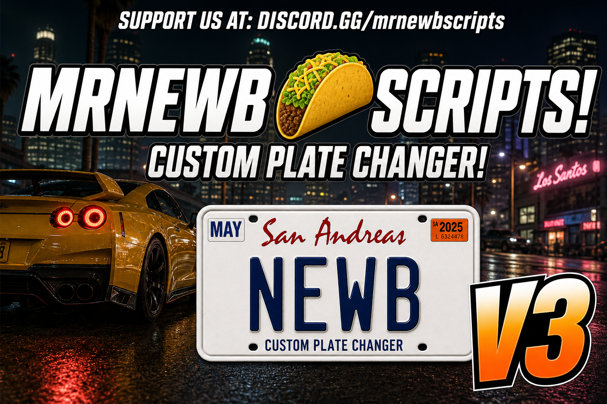

# MrNewbCustomPlates

Usable plate item. Type a plate on the license-plate overlay, it is filtered, then applied to a nearby owned vehicle.

[Documentation](https://mrnewb.github.io/docs/mrnewbcustomplates) · [Install guide](https://mrnewb.github.io/docs/mrnewbcustomplates/install) · [Tebex](https://mrnewbscripts.tebex.io/) · [Discord](https://discord.gg/mrnewbscripts) · [Preview](https://www.youtube.com/watch?v=fGq9QBig3j4)



[](https://www.youtube.com/watch?v=fGq9QBig3j4)

## Features

- License-plate NUI (letters and numbers only, max 8)
- Banned-word and length rejects stay on the overlay
- Must be outside the vehicle, next to a networked vehicle they own
- Server re-checks plate text, distance, ownership, uniqueness, and that the item is still in inventory
- Optional 5s apply progress
- Vehicle-key swap through `bridge.vehiclekeys`
- Optional ox_inventory hook that blocks **giving** the item away

## Install

Needs [ox_lib](https://github.com/overextended/ox_lib), [oxmysql](https://github.com/overextended/oxmysql), and [Newb_Bridge](https://github.com/MrNewb/Newb_Bridge). Item paste: [install guide](https://mrnewb.github.io/docs/mrnewbcustomplates/install).

```cfg
ensure ox_lib
ensure oxmysql
ensure Newb_Bridge
ensure MrNewbCustomPlates
```

Do not add `server.export` on the ox_inventory item. Omit `consume` on the item def.

## Config

`configs/config.lua` — `PlateItemName` (default `customizableplate`), min/max length, `FilteredWords`, progress bar toggle, optional ox exclusive.

The player must be outside the vehicle. The server re-checks before writing. Optional: [MrNewbVehicleKeys](https://github.com/MrNewb/MrNewbVehicleKeysV2) so key metadata follows the new plate.

SQL details: [framework](https://mrnewb.github.io/docs/mrnewbcustomplates/install/framework). Inventory icons by [Decay Studios](https://discord.gg/yDXZwZPjdN).
